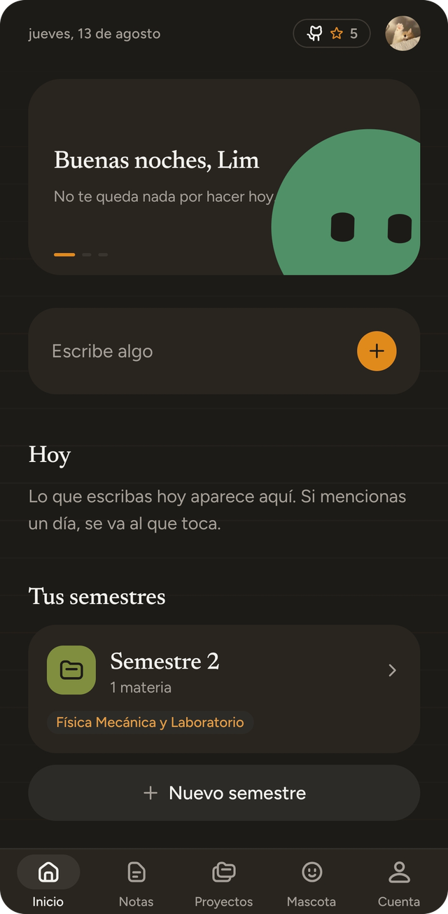
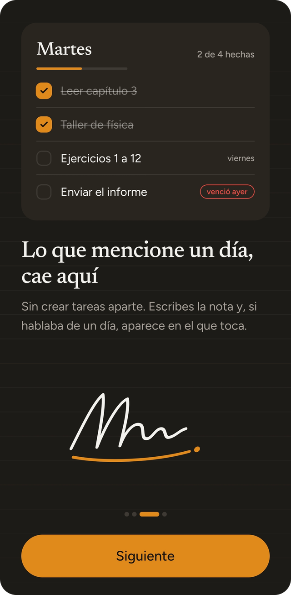
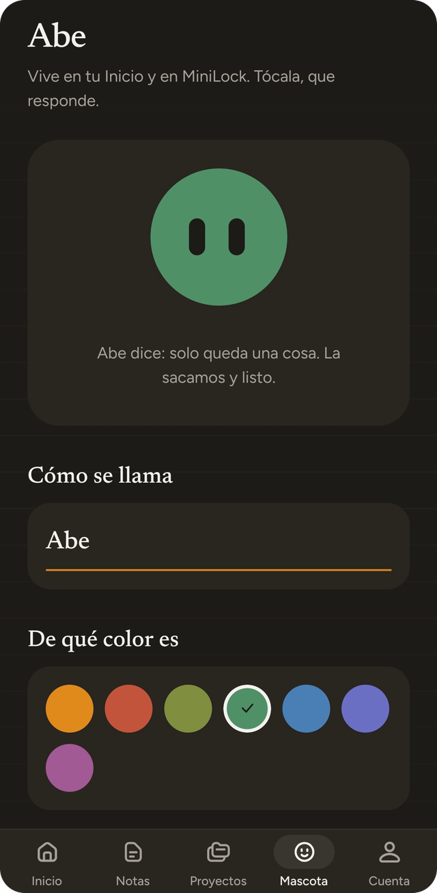

<p align="center">
  
</p>

<p align="center">
  <a href="LICENSE"></a>
  
  
  <a href="README.md"></a>
</p>

# Miniout

Apuntes y tareas de universidad. La abres y el campo ya esta esperando.

## Por que

Toda app de notas te hace decidir algo antes de dejarte escribir. Que cuaderno,
que lista, que proyecto, que etiqueta. Esa decision llega en el peor momento
posible, en mitad de una clase y con la idea a punto de irse.

Miniout le da la vuelta. Primero escribes y archivas despues, si es que llegas a
archivar. Una nota y una tarea son lo mismo escrito igual, asi que lo que
mencione un dia pasa a tener fecha.

## Que hace

- El campo de captura es la pantalla de inicio. No hay boton para crear una nota
  ni para crear una tarea.
- Escribe "parcial de calculo el viernes" y Miniout te ofrece la materia y el
  dia como chips. Tu decides si se quedan.
- Una nota puede llevar titulo, fecha de entrega, calificacion e imagenes, y
  todo eso es opcional.
- El editor es a pantalla completa y su barra de formato ocupa todo el ancho:
  negrita, cursiva, titulos, listas y casillas.
- Las imagenes salen de la galeria o de la camara. Al abrir una la mueves, la
  acercas con dos dedos, la giras y la quitas.
- El dictado escribe lo que dices dentro de la nota, con el reconocedor de voz
  que ya trae el telefono.
- Las calificaciones usan tu escala, con el 0 a 20 incluido, y llevan un badge
  que cambia de color si estas por debajo de lo que necesitas para pasar.
  Tambien puedes ordenar y filtrar por ellas.
- Los proyectos son cajones: Universidad, Compras, Personal. Desliza una nota a
  la derecha para moverla, o usa los tres puntos. Manten pulsado un proyecto
  para cambiarlo de sitio.
- El alta pregunta cuatro cosas una sola vez: como llamarte, colegio o
  universidad, tu escala de notas y con cuanto pasas. La app se adapta, asi que
  los semestres pasan a llamarse periodos si estas en el colegio.
- Los semestres guardan materias, cada uno con su icono y su color, y una nota
  que mencione una materia cuenta para ella.
- MiniLock pone un codigo de cuatro digitos delante de tus notas.
- Una frase al dia, las nuestras o las que escribas tu.
- Tu cuenta te sigue: correo, Google o Discord, con la foto del metodo que
  usaste.

## Capturas

<p align="center">
  
  
  
</p>

## Estado

En alpha. Las etiquetas desde
[v1.0.0-alpha.1](https://github.com/dimelim/miniout/releases) llevan builds de
Android instalables. Lo que la app hace hoy es real y habla con la API en vivo,
pero las pantallas siguen moviendose.

Las builds llevan actualizaciones por aire, asi que la version nueva llega sola
la proxima vez que abras la app.

## Stack

Expo SDK 57 con expo-router, React Native 0.86 y React 19.
[heroui-native](https://github.com/heroui-inc/heroui-native) pone los
componentes bajo Apache-2.0, tematizados con los tokens propios de Miniout, y
[uniwind](https://uniwind.dev) trae las clases de Tailwind v4 a React Native.
Las notas, los proyectos y las imagenes viven en la api, cifrados con
AES-256-GCM. Las preferencias se quedan en el telefono con AsyncStorage.

## Arrancar

```bash
npm install
npx expo start
```

Se abre con Expo Go en un dispositivo, o con `a` para el emulador de Android. No
hace falta el SDK de Android para desarrollar, porque las builds van por EAS.

## Scripts

```bash
npm test          # jest, cubre el parser que lee materias y fechas
npm run typecheck # tsc
npm run icons     # regenera los iconos de la app desde la marca
```

## Estructura

```
src/
  app/            rutas de expo-router: onboarding, acceso, alta, pestanas, editor
  components/     la marca, la firma, la gota de tinta y las piezas comunes
  lib/            fechas, pistas, notas, proyectos, imagenes y cliente de api
  global.css      los tokens de diseno que tematizan heroui-native
api/              el servicio que da cuentas, sincronizacion e imagenes
scripts/          generacion de iconos y despliegue de la api
```

## Diseno

Los colores son una paleta elegida por mi: una escala neutra calida con un
solo acento ambar que se comporta como resaltador, Newsreader para titulos y
Figtree para todo lo demas. Los colores se editan en `src/global.css` y en
ningun otro sitio.

Hay algo que conviene saber antes de tocar un color. El ambar base da 2.59:1
contra el papel claro, asi que nunca lleva texto en modo claro. Los links y el
texto pequeno usan `--color-accent-deep`, que mide 4.79:1.

## Contribuir

Los issues y pull requests son bienvenidos. Dos reglas propias de este repo.

- Sin comentarios en el codigo. Si una linea necesita explicacion, el arreglo es
  un mejor nombre.
- Nunca guion largo y nunca emojis, ni en codigo, ni en interfaz, ni en docs, ni
  en mensajes de commit.

## Licencia

Apache-2.0. Ver [LICENSE](LICENSE).

Puedes usar esto en tu propio trabajo, incluso comercialmente. Lo que no puedes
es cogerlo y hacerlo pasar por tuyo. Conserva el archivo [NOTICE](NOTICE) y
acredita a Miniout, que es lo que pide la seccion 4(d) de la licencia. Con un
enlace al repositorio basta.

Los iconos de la interfaz salen de
[@gravity-ui/icons](https://github.com/gravity-ui/icons), bajo MIT.
