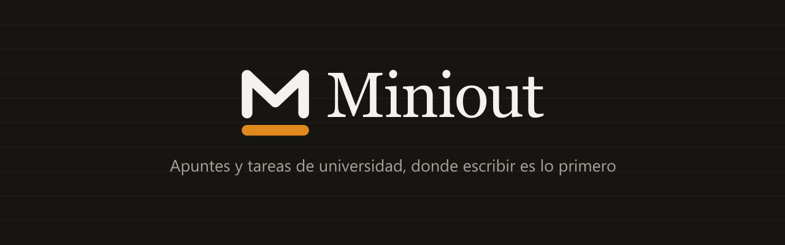

<p align="center">
  
</p>

<p align="center">
  <a href="LICENSE"></a>
  
  
  <a href="README.es.md"></a>
</p>

# Miniout

Notes and tasks for university. You open it and the field is already waiting.

## Why

Every notes app makes you decide something before it lets you write. Which
notebook, which list, which project, which tag. That decision arrives at the
worst possible moment, in the middle of a class with the thought about to leave.

Miniout turns it around. You write first and file later, if you ever file at
all. A note and a task are the same thing typed the same way, so anything that
mentions a day becomes something due.

## What it does

- The capture field is the home screen. There is no button to create a note and
  none to create a task.
- Write "parcial de calculo el viernes" and Miniout offers the subject and the
  day as chips. You decide whether they stay.
- A note can carry a title, a due date, a grade and pictures, and every one of
  them is optional.
- The editor is full screen with a formatting bar that spans the whole width:
  bold, italic, headings, bullets and checkboxes.
- Pictures come from the gallery or the camera. Open one and you can drag it,
  pinch it, spin it and throw it away.
- Dictation writes what you say straight into the note, using the speech
  recognizer that already lives on the phone.
- Grades use your own scale, 0 to 20 included, with a badge that turns color
  when you are below the passing mark. You can sort and filter by them.
- Projects are drawers: Universidad, Compras, Personal. Swipe a note to the
  right to move it, or use the three dots. Hold a project to reorder it.
- Setup asks four questions once: what to call you, school or university, your
  grading scale and the passing mark. The app renames things to match, so a
  semester becomes a term if you are still in school.
- Semesters hold subjects, each with its own icon and color, and a note that
  mentions a subject counts towards it.
- MiniLock puts a four digit code in front of your notes.
- A phrase a day, either ours or the ones you write.
- Your account travels with you: email, Google or Discord, with the profile
  photo from whichever you used.

## Status

Alpha. The tags [v1.0.0-alpha.1](https://github.com/dimelim/miniout/releases)
onwards carry installable Android builds. Anything the app can do today is real
and talks to the live API, but screens keep moving.

Builds ship with over the air updates, so a new JS version arrives on its own
the next time you open the app.

## Stack

Expo SDK 57 with expo-router, React Native 0.86 and React 19.
[heroui-native](https://github.com/heroui-inc/heroui-native) provides the
components under Apache-2.0, themed with Miniout's own tokens, and
[uniwind](https://uniwind.dev) brings Tailwind v4 class names to React Native.
Notes, projects and pictures live in the API, encrypted at rest with
AES-256-GCM. Preferences stay on the device through AsyncStorage.

## Getting started

```bash
npm install
npx expo start
```

Open it with Expo Go on a device, or press `a` for an Android emulator. You do
not need the Android SDK to develop, since builds go through EAS.

## Scripts

```bash
npm test          # jest, covers the parser that reads subjects and dates
npm run typecheck # tsc
npm run icons     # rebuilds the app icons from the mark
```

## Project layout

```
src/
  app/            expo-router routes: onboarding, sign in, setup, tabs, editor
  components/     the mark, the signature, the ink drop and the shared pieces
  lib/            dates, hint detection, grades, projects, images and the client
  global.css      the design tokens that theme heroui-native
api/              the service that backs accounts, sync and picture storage
scripts/          icon generation and the api deploy
```

## Design

Colors are a palette of my own choosing: a warm neutral scale with a single
amber accent that behaves like a highlighter, Newsreader for headings and
Figtree for everything else. Colors are edited in `src/global.css` and nowhere
else.

One thing worth knowing before you touch a color. The base amber sits at 2.59:1
against the light canvas, so it never carries text in light mode. Links and
small text use `--color-accent-deep` instead, which measures 4.79:1.

## Contributing

Issues and pull requests are welcome. Two rules specific to this repo.

- No comments in the code. If a line needs an explanation, the fix is a better
  name.
- No em dashes and no emojis anywhere, whether in code, interface, docs or
  commit messages.

## License

Apache-2.0. See [LICENSE](LICENSE).

You can use this in your own work, including commercially. What you cannot do
is take it and pretend it is yours. Keep the [NOTICE](NOTICE) file and credit
Miniout, which is what section 4(d) of the license asks for. A link back to the
repository is enough.

The interface icons come from
[@gravity-ui/icons](https://github.com/gravity-ui/icons), under MIT.
